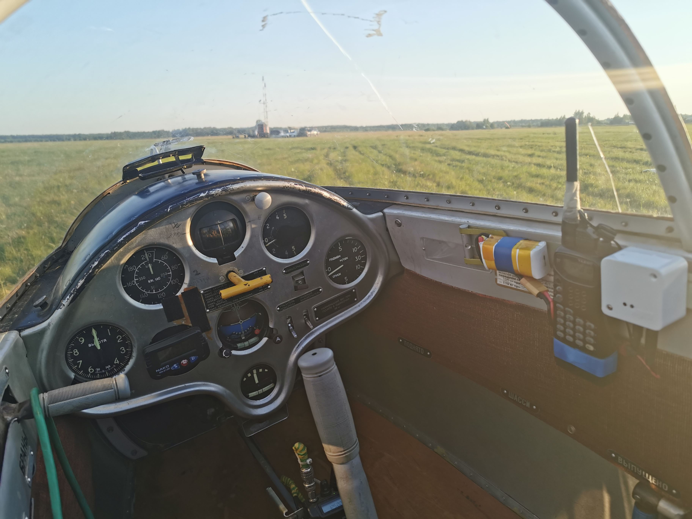

# AIR-TRANSPONDER
Проект предназначен для передачи параметров полёта воздушного судна на базовую станцию по радиоканалу, без использования операторов связи. 
Пеердаются транспондером и принимаются базовой станцией в режиме реального времени: 
* Место,
* Высота,
* Скорость,
* Скороподъёмность,
* Курс,
* Номер борта.

Колличество одновременно работающих транспондеров 10.
Отображение на офлайн карте, в режиме реального времени, меток с указанием параметров полёта, а так же:
* Удаление от точки старта.
* Название ближайшего населённого пункта и расстояние до него.
Отображение метеоданных на точке старта:
* Направление ветра
* Скорость ветра
* Порывы Ветра
* Температура

## Требования.
  Базовая станция:
  * Декодер данных. ESP8266(либо Arduino UNO с ETH шильдом)
  * Сервер. Ноутбук с ОС LINUX.
  * Ресивер. В качестве приёмника используется носимая портативная радиостанция 144/433MHz
  * Антенна стационарная внешняя с круговой диаграммой. 
  
  
  Транспондер:
  * GPS модуль GPS NEO-6M-0-001,
  * Кодер данных - Arduino Nano,
  * Трансмиттер. В качестве передатчика используется носимая портативная радиостанция 144/433MHz.
  

Модуляция FSK (FM).
Подключение кодера/декодера к приёмнику/передатчику простое, с помощью аудиокабеля. Используются штатные разъемы радиостанций.
Подключение к серверу базовой станции: компьютер/смартфон ethernet кабель либо wifi. 
Данные отображаются на экране в виде интеракивной оффлайн карты месности, где производятся полёты. Активные метки на карте отображают положение(и прочие параметры полёта) воздушных средств находящихся в воздухе в реальном времени. Время смещения(задержки) 4 секунды. Дальность действия транспондера определяется качеством трансмиттера и приёмника. 
## Лётные испытания
Для тестирования и отладки системы транспондер устанавливался на планёр Blanik L13. 
 Базовая станция разворачивалась на СКП - точке старта, в полевых условиях. Летные испытания показали что уверенный приём, передаваемых параметров полёта, осуществляется на расстоянии 8 км и высотой полёта не вышее 1200 метров, при мощности излучения 100 милливат. На большие расстояния тесты пока не проводились.

## Благодарность
Отдельное специальное спасибо INVANDY. Начало было положенно благодаря его проекту https://github.com/invandy/Oregon_NR
